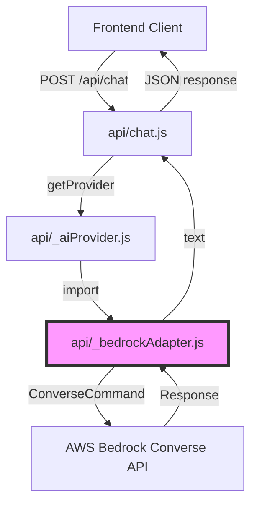
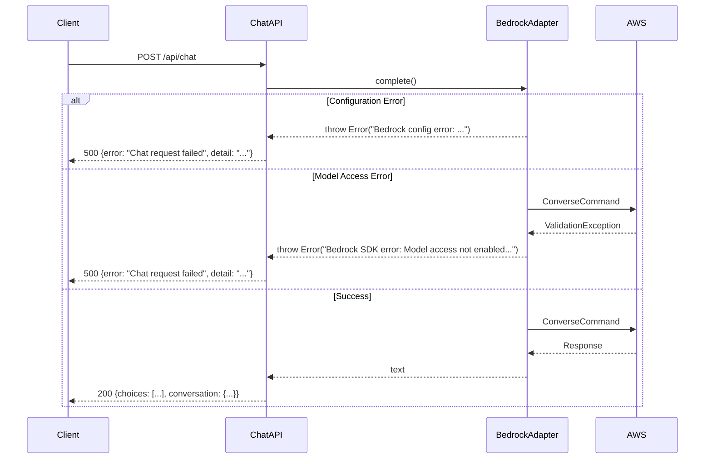

# Design Document: AWS Bedrock Model Upgrade

## Overview

This design specifies the implementation for upgrading the AWS Bedrock integration from the legacy Claude Haiku 3 model (`anthropic.claude-3-haiku-20240307-v1:0`) to Claude Haiku 4.5 (`anthropic.claude-haiku-4-5-20251001-v1:0`). The upgrade is primarily a configuration change that updates the default model identifier while maintaining full backward compatibility with the existing chat API.

### Scope

**In Scope:**
- Update default `BEDROCK_MODEL_ID` constant in `api/_bedrockAdapter.js`
- Update `.env.example` documentation with new default model
- Enhance error messages for model access issues
- Add model validation logic
- Improve configuration logging

**Out of Scope:**
- Changes to the Converse API request/response structure (already compatible)
- Changes to the chat API contract (maintains existing interface)
- Frontend modifications (no client-side changes needed)
- Multi-model selection UI (environment variable configuration only)
- Model-specific inference parameter tuning (uses existing defaults)

### Design Principles

1. **Minimal Change**: Update only the model identifier constant and related documentation
2. **Backward Compatibility**: Existing deployments continue to work with clear upgrade path
3. **Configuration-Driven**: Model selection via environment variables without code changes
4. **Clear Error Messages**: Descriptive errors for model access and configuration issues
5. **Zero Downtime**: Deployment requires only environment variable update and restart

## Architecture

### System Context



### Component Interaction

The model upgrade affects only the `_bedrockAdapter.js` module:

1. **Chat Handler** (`api/chat.js`) - No changes required
   - Continues to call `getProvider()` and `provider.complete()`
   - Maintains existing request/response format

2. **AI Provider** (`api/_aiProvider.js`) - No changes required
   - Continues to route to Bedrock adapter when `AI_PROVIDER=bedrock`

3. **Bedrock Adapter** (`api/_bedrockAdapter.js`) - **Primary change target**
   - Update `DEFAULT_MODEL_ID` constant from Claude Haiku 3 to Haiku 4.5
   - Enhance model validation and error messages
   - Improve configuration logging

4. **Environment Configuration** (`.env.example`) - Documentation update
   - Update default `BEDROCK_MODEL_ID` example
   - Add comments documenting supported models

## Components and Interfaces

### Modified Component: Bedrock Adapter

**File:** `api/_bedrockAdapter.js`

**Current Implementation:**
```javascript
const DEFAULT_MODEL_ID = 'anthropic.claude-3-haiku-20240307-v1:0'
```

**New Implementation:**
```javascript
const DEFAULT_MODEL_ID = 'anthropic.claude-haiku-4-5-20251001-v1:0'
```

**Interface (Unchanged):**
```javascript
/**
 * @param {Object} params
 * @param {string} params.systemPrompt
 * @param {string} params.context
 * @param {Array<{role:string, content:string}>} params.history
 * @param {string} params.userMessage
 * @returns {Promise<string>}
 */
export async function complete({ systemPrompt, context, history = [], userMessage })
```

### Enhanced Functions

#### 1. Model Validation (New)

Add a validation function to check model ID format:

```javascript
/**
 * Validates that the model ID follows AWS Bedrock naming conventions
 * @param {string} modelId
 * @returns {boolean}
 */
function isValidModelId(modelId) {
  // Format: provider.model-name-version-v1:0
  // Examples:
  // - anthropic.claude-haiku-4-5-20251001-v1:0
  // - anthropic.claude-3-sonnet-20240229-v1:0
  // - meta.llama3-70b-instruct-v1:0
  // - amazon.titan-text-express-v1
  
  const pattern = /^(anthropic|meta|amazon)\.[a-z0-9-]+(-v\d+)?(:0)?$/i
  return pattern.test(modelId)
}
```

#### 2. Enhanced Error Description

Update `describeBedrockError` to handle more error cases:

```javascript
function describeBedrockError(err, { region, modelId }) {
  const name = String(err?.name || '')
  const message = String(err?.message || err || '')
  const status = err?.$metadata?.httpStatusCode
  const requestId = err?.$metadata?.requestId

  console.error(JSON.stringify({
    event: 'bedrock_runtime_error',
    name,
    message,
    status,
    requestId,
    region,
    modelId,
  }))

  // Model access not enabled
  if (name === 'ValidationException' && /operation not allowed/i.test(message)) {
    return [
      'Bedrock model access is not enabled for this AWS account, region, or model.',
      `AWS rejected ${modelId} in ${region} with: Operation not allowed.`,
      'Enable Bedrock model access for this model and confirm the IAM principal can invoke it.',
    ].join(' ')
  }

  // Model not found or invalid
  if (name === 'ValidationException' && /model.*not found/i.test(message)) {
    return [
      `Model ${modelId} is not available in region ${region}.`,
      'Verify the model ID is correct and the model is available in your region.',
    ].join(' ')
  }

  // Authentication errors
  if (name === 'UnrecognizedClientException' || name === 'InvalidSignatureException') {
    return [
      'AWS authentication failed.',
      'Verify AWS_ACCESS_KEY_ID, AWS_SECRET_ACCESS_KEY, and AWS_SESSION_TOKEN (if using temporary credentials) are correct.',
    ].join(' ')
  }

  // Throttling
  if (name === 'ThrottlingException') {
    return `AWS Bedrock request throttled. ${message}`
  }

  return message || 'Unknown Bedrock SDK error'
}
```

#### 3. Enhanced Configuration Logging

Update `logBedrockConfigOnce` to include model validation:

```javascript
function logBedrockConfigOnce({ accessKeyId, secretAccessKey, sessionToken, region, modelId }) {
  if (loggedConfig) return
  loggedConfig = true

  const isValid = isValidModelId(modelId)
  
  console.info(JSON.stringify({
    event: 'bedrock_runtime_config',
    provider: String(process.env.AI_PROVIDER || 'openai').trim().toLowerCase(),
    region,
    modelId,
    modelIdValid: isValid,
    hasAccessKeyId: Boolean(accessKeyId),
    accessKeyPrefix: accessKeyId.slice(0, 4),
    credentialMode: getCredentialMode(accessKeyId),
    hasSecretAccessKey: Boolean(secretAccessKey),
    hasSessionToken: Boolean(sessionToken),
  }))

  if (!isValid) {
    console.warn(`Warning: Model ID "${modelId}" does not match expected AWS Bedrock format`)
  }
}
```

### Modified Configuration: Environment Variables

**File:** `.env.example`

**Current:**
```bash
# Bedrock (required when AI_PROVIDER=bedrock)
AWS_ACCESS_KEY_ID=your_aws_access_key_id
AWS_SECRET_ACCESS_KEY=your_aws_secret
# Required only when AWS_ACCESS_KEY_ID starts with ASIA.
AWS_SESSION_TOKEN=
AWS_REGION=us-east-1
BEDROCK_MODEL_ID=anthropic.claude-3-haiku-20240307-v1:0
```

**New:**
```bash
# Bedrock (required when AI_PROVIDER=bedrock)
AWS_ACCESS_KEY_ID=your_aws_access_key_id
AWS_SECRET_ACCESS_KEY=your_aws_secret
# Required only when AWS_ACCESS_KEY_ID starts with ASIA.
AWS_SESSION_TOKEN=
AWS_REGION=us-east-1

# Bedrock Model Configuration
# Default: Claude Haiku 4.5 (fast, cost-effective)
# Supported models (ensure model access is enabled in AWS Bedrock console):
#   Claude: anthropic.claude-haiku-4-5-20251001-v1:0 (default)
#           anthropic.claude-3-5-sonnet-20241022-v2:0
#           anthropic.claude-3-5-opus-20240229-v1:0
#   Meta:   meta.llama3-70b-instruct-v1:0
#   Amazon: amazon.titan-text-express-v1
BEDROCK_MODEL_ID=anthropic.claude-haiku-4-5-20251001-v1:0
```

## Data Models

No data model changes required. The Bedrock Converse API request and response structures remain identical:

**Request Structure (Unchanged):**
```javascript
{
  modelId: string,
  messages: Array<{
    role: 'user' | 'assistant',
    content: Array<{ text: string }>
  }>,
  inferenceConfig: {
    maxTokens: number,
    temperature: number
  },
  system?: Array<{ text: string }>
}
```

**Response Structure (Unchanged):**
```javascript
{
  output: {
    message: {
      content: Array<{ text: string }>
    }
  },
  $metadata: {
    httpStatusCode: number,
    requestId: string
  }
}
```

## Error Handling

### Error Categories

1. **Configuration Errors** (Startup)
   - Missing AWS credentials
   - Invalid credential format
   - Missing region
   - Invalid model ID format

2. **Runtime Errors** (Per Request)
   - Model access not enabled
   - Model not found in region
   - Authentication failure
   - Throttling
   - Invalid response format

### Error Flow



### Error Messages

| Error Type | User-Facing Message | Resolution |
|------------|---------------------|------------|
| Missing credentials | "Bedrock config error: missing AWS_ACCESS_KEY_ID" | Set AWS credentials in environment |
| Model access denied | "Bedrock model access is not enabled..." | Enable model in AWS Bedrock console |
| Invalid model ID | "Model ... is not available in region ..." | Verify model ID and region |
| Authentication failed | "AWS authentication failed. Verify credentials..." | Check AWS credentials |
| Throttling | "AWS Bedrock request throttled..." | Retry with backoff |

## Testing Strategy

### Testing Approach

This feature involves **infrastructure configuration and external service integration**, not pure business logic. Property-based testing is **not applicable** because:

1. The change is a configuration update (model ID constant)
2. Testing requires live AWS Bedrock API access
3. Behavior is deterministic for a given model (no meaningful input variation)
4. AWS SDK handles request/response formatting

**Appropriate Testing Strategy:**

1. **Manual Integration Testing** - Primary validation method
2. **Example-Based Unit Tests** - For validation and error handling logic
3. **Deployment Verification** - Smoke tests in staging/production

### Test Plan

#### 1. Unit Tests (New)

**File:** `api/_bedrockAdapter.test.js` (to be created)

Test the new validation and error handling functions:

```javascript
describe('isValidModelId', () => {
  it('should accept valid Claude model IDs', () => {
    expect(isValidModelId('anthropic.claude-haiku-4-5-20251001-v1:0')).toBe(true)
    expect(isValidModelId('anthropic.claude-3-5-sonnet-20241022-v2:0')).toBe(true)
  })

  it('should accept valid Meta model IDs', () => {
    expect(isValidModelId('meta.llama3-70b-instruct-v1:0')).toBe(true)
  })

  it('should accept valid Amazon model IDs', () => {
    expect(isValidModelId('amazon.titan-text-express-v1')).toBe(true)
  })

  it('should reject invalid formats', () => {
    expect(isValidModelId('invalid-model')).toBe(false)
    expect(isValidModelId('')).toBe(false)
    expect(isValidModelId('anthropic')).toBe(false)
  })
})

describe('describeBedrockError', () => {
  it('should identify model access errors', () => {
    const err = {
      name: 'ValidationException',
      message: 'operation not allowed',
      $metadata: { httpStatusCode: 400, requestId: 'test-123' }
    }
    const message = describeBedrockError(err, { region: 'us-east-1', modelId: 'test-model' })
    expect(message).toContain('model access is not enabled')
  })

  it('should identify authentication errors', () => {
    const err = {
      name: 'UnrecognizedClientException',
      message: 'The security token included in the request is invalid',
      $metadata: { httpStatusCode: 403, requestId: 'test-456' }
    }
    const message = describeBedrockError(err, { region: 'us-east-1', modelId: 'test-model' })
    expect(message).toContain('AWS authentication failed')
  })
})
```

#### 2. Integration Tests (Manual)

**Test Environment:** Staging with AWS Bedrock access

**Test Cases:**

| Test Case | Setup | Expected Result |
|-----------|-------|-----------------|
| Default model (Haiku 4.5) | Remove `BEDROCK_MODEL_ID` from env | Chat request succeeds with Haiku 4.5 |
| Explicit Haiku 4.5 | Set `BEDROCK_MODEL_ID=anthropic.claude-haiku-4-5-20251001-v1:0` | Chat request succeeds |
| Legacy model (Haiku 3) | Set `BEDROCK_MODEL_ID=anthropic.claude-3-haiku-20240307-v1:0` | Error: "model access is not enabled" (expected) |
| Invalid model ID | Set `BEDROCK_MODEL_ID=invalid-model` | Error with validation warning in logs |
| Missing credentials | Remove `AWS_ACCESS_KEY_ID` | Error: "missing AWS_ACCESS_KEY_ID" |
| Wrong region | Set `AWS_REGION=eu-west-1` (if model not enabled there) | Error: "model access is not enabled" |

**Test Procedure:**

1. Deploy to staging environment
2. Configure test environment variables
3. Send test chat request via frontend or API client
4. Verify response or error message
5. Check server logs for configuration logging

#### 3. Deployment Verification (Smoke Tests)

**Post-Deployment Checklist:**

- [ ] Server starts without configuration errors
- [ ] Configuration log shows correct model ID
- [ ] Test chat request completes successfully
- [ ] Response format matches existing API contract
- [ ] Error handling works for invalid requests
- [ ] Performance metrics are within acceptable range

### Test Coverage Goals

- **Unit Tests:** 100% coverage of new validation and error handling functions
- **Integration Tests:** All supported models tested in staging
- **Smoke Tests:** Production deployment verified with default configuration

### Testing Timeline

1. **Development:** Write unit tests alongside code changes
2. **Pre-Deployment:** Run integration tests in staging
3. **Deployment:** Execute smoke tests in production
4. **Post-Deployment:** Monitor error logs for 24 hours

## Implementation Plan

### Phase 1: Code Changes

**Files to Modify:**

1. `api/_bedrockAdapter.js`
   - Update `DEFAULT_MODEL_ID` constant
   - Add `isValidModelId()` function
   - Enhance `describeBedrockError()` function
   - Update `logBedrockConfigOnce()` function

2. `.env.example`
   - Update `BEDROCK_MODEL_ID` default value
   - Add comments documenting supported models

**Estimated Effort:** 1-2 hours

### Phase 2: Testing

1. Create unit tests for validation functions
2. Run unit tests locally
3. Deploy to staging environment
4. Execute integration test cases
5. Verify error handling

**Estimated Effort:** 2-3 hours

### Phase 3: Deployment

1. Update production environment variable `BEDROCK_MODEL_ID`
2. Deploy code changes to Vercel
3. Execute smoke tests
4. Monitor logs and error rates

**Estimated Effort:** 1 hour + monitoring

### Rollback Plan

If issues occur in production:

1. **Immediate:** Revert `BEDROCK_MODEL_ID` to previous value (if it was explicitly set)
2. **Code Rollback:** Revert deployment in Vercel dashboard
3. **Verification:** Confirm chat functionality restored

**Note:** Since the default model is changing, new deployments without explicit `BEDROCK_MODEL_ID` will use Haiku 4.5. To use a different model, set `BEDROCK_MODEL_ID` explicitly.

## Deployment Considerations

### Environment Variable Updates

**Required Action:** Update `BEDROCK_MODEL_ID` in Vercel environment variables

**Options:**

1. **Use Default (Recommended):** Remove `BEDROCK_MODEL_ID` variable to use Haiku 4.5 default
2. **Explicit Configuration:** Set `BEDROCK_MODEL_ID=anthropic.claude-haiku-4-5-20251001-v1:0`

### AWS Bedrock Model Access

**Pre-Deployment Requirement:** Ensure Claude Haiku 4.5 model access is enabled

**Steps:**

1. Log in to AWS Console
2. Navigate to Amazon Bedrock service
3. Go to "Model access" in the left sidebar
4. Verify "anthropic.claude-haiku-4-5-20251001-v1:0" shows "Access granted"
5. If not enabled, request access (usually instant for Claude models)

### Zero-Downtime Deployment

The deployment can be performed with zero downtime:

1. Code changes are backward compatible
2. Environment variable update takes effect on next request
3. No database migrations required
4. No API contract changes

### Monitoring

**Metrics to Monitor:**

- Error rate (should remain stable)
- Response time (Haiku 4.5 should be similar to Haiku 3)
- AWS Bedrock API costs (monitor for unexpected changes)
- Model access errors (should be zero after verification)

**Log Queries:**

```javascript
// Configuration logging
{ event: "bedrock_runtime_config", modelId: "anthropic.claude-haiku-4-5-20251001-v1:0" }

// Successful requests
{ event: "ai_chat_request", provider: "bedrock", success: true }

// Errors
{ event: "bedrock_runtime_error", name: "ValidationException" }
```

## Documentation Updates

### Files to Update

1. **README.md** (if exists)
   - Update AWS Bedrock setup instructions
   - Document new default model
   - Add troubleshooting section for model access

2. **.env.example**
   - Already covered in Components section

3. **Deployment Guide** (if exists)
   - Add model access verification step
   - Document environment variable configuration

### Developer Documentation

**Topics to Document:**

1. How to change models (environment variable)
2. How to verify model access in AWS
3. How to interpret model access errors
4. List of supported models
5. Cost considerations for different models

## Security Considerations

### No Security Impact

This change does not affect security posture:

- AWS credentials remain unchanged
- Authentication flow unchanged
- Authorization unchanged
- No new external dependencies
- No changes to data handling

### Credential Validation

Existing credential validation remains in place:

- Trimming whitespace from credentials (prevents accidental newlines)
- Validating credential format (AKIA vs ASIA prefix)
- Requiring session token for temporary credentials
- Validating credential length

## Performance Considerations

### Expected Performance

Claude Haiku 4.5 performance characteristics:

- **Latency:** Similar to Haiku 3 (fast responses)
- **Throughput:** Comparable to Haiku 3
- **Cost:** Similar pricing tier (cost-effective)
- **Quality:** Improved over Haiku 3

### No Performance Degradation Expected

- Same Converse API endpoint
- Same inference configuration (maxTokens: 1200, temperature: 0.7)
- Same request/response structure
- Same network path

### Monitoring Recommendations

Monitor these metrics for 24-48 hours post-deployment:

- Average response time
- P95/P99 response time
- Error rate
- AWS Bedrock API costs

## Future Enhancements

### Out of Scope for This Release

1. **Dynamic Model Selection**
   - UI for selecting models per conversation
   - Per-user model preferences
   - Per-class model configuration

2. **Model-Specific Optimizations**
   - Custom inference parameters per model
   - Model-specific prompt engineering
   - Fallback model chains

3. **Multi-Model Support**
   - A/B testing different models
   - Load balancing across models
   - Cost optimization routing

4. **Advanced Features**
   - Streaming responses
   - Function calling
   - Vision capabilities (for models that support it)

### Potential Future Work

If additional models are needed:

1. Add model registry with capabilities
2. Implement model selection logic
3. Add model-specific parameter tuning
4. Create model comparison testing framework

## Appendix

### Supported Model IDs

**Claude Models:**
- `anthropic.claude-haiku-4-5-20251001-v1:0` (default, fast, cost-effective)
- `anthropic.claude-3-5-sonnet-20241022-v2:0` (balanced, higher quality)
- `anthropic.claude-3-5-opus-20240229-v1:0` (highest quality, slower, expensive)

**Meta Models:**
- `meta.llama3-70b-instruct-v1:0` (open source, good for specific tasks)

**Amazon Models:**
- `amazon.titan-text-express-v1` (AWS native, cost-effective)

### AWS Bedrock Regions

Claude Haiku 4.5 is available in:
- `us-east-1` (N. Virginia) - **Recommended**
- `us-west-2` (Oregon)
- `eu-west-1` (Ireland)
- `ap-southeast-1` (Singapore)

Verify model availability in your region via AWS Console.

### Cost Comparison

Approximate costs (as of deployment, verify current pricing):

| Model | Input (per 1K tokens) | Output (per 1K tokens) | Use Case |
|-------|----------------------|------------------------|----------|
| Claude Haiku 4.5 | $0.00025 | $0.00125 | Default, fast responses |
| Claude Sonnet 3.5 | $0.003 | $0.015 | Complex reasoning |
| Claude Opus 3.5 | $0.015 | $0.075 | Highest quality |

### References

- [AWS Bedrock Converse API Documentation](https://docs.aws.amazon.com/bedrock/latest/APIReference/API_runtime_Converse.html)
- [Claude Model Documentation](https://docs.anthropic.com/claude/docs/models-overview)
- [AWS Bedrock Model Access](https://docs.aws.amazon.com/bedrock/latest/userguide/model-access.html)
- [Vercel Environment Variables](https://vercel.com/docs/concepts/projects/environment-variables)
