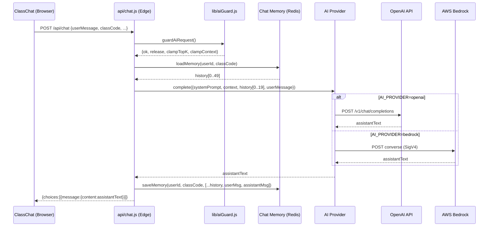

# Design Document: bedrock-chat-memory-ui

## Overview

This feature extends the AISCHOOL3 platform with three coordinated changes:

1. **Provider Abstraction** — a thin adapter layer (`api/_aiProvider.js`) that routes inference calls to either OpenAI or AWS Bedrock based on the `AI_PROVIDER` environment variable, with no changes to business logic.
2. **Server-Side Chat Memory** — the last 50 messages per user+class session are persisted in Upstash Redis under the key `chat:mem:{userId}:{classCode}` with a 30-day TTL, so conversation context survives page refreshes.
3. **ClassChat UI Redesign** — `src/pages/ClassChat.jsx` is redesigned to be clean, modern, and production-ready while preserving all existing ReactMarkdown, math, and code-block rendering.

The existing `lib/aiGuard.js` rate-limiting and lock infrastructure is reused without modification. The existing `api/_db.js` Redis client is extended with a `setex` command to support TTL writes. All new Redis keys use the `chat:mem:*` namespace, which does not conflict with the existing `ai:lock:*` and `ai:rl:*` namespaces.

---

## Architecture

### Request Flow (after this feature)



### File Map

| File | Change |
|---|---|
| `api/_aiProvider.js` | **New** — provider interface definition |
| `api/_bedrockAdapter.js` | **New** — Bedrock Converse API + SigV4 |
| `api/_openaiAdapter.js` | **New** — wraps existing OpenAI proxy logic |
| `api/chat.js` | **Refactored** — uses provider + loads/saves memory |
| `api/_db.js` | **Extended** — adds `setex` command |
| `src/pages/ClassChat.jsx` | **Redesigned** — modern UI |

No changes to `lib/aiGuard.js`, `src/utils/openai.js`, `src/utils/storage.js`, or any other files.

---

## Components and Interfaces

### `api/_aiProvider.js` — Provider Interface

Defines the contract that both adapters must satisfy. Exports a factory function `getProvider()` that reads `AI_PROVIDER` and returns the correct adapter.

```js
// Interface contract (JSDoc)
/**
 * @typedef {Object} AIProvider
 * @property {(params: CompleteParams) => Promise<string>} complete
 */

/**
 * @typedef {Object} CompleteParams
 * @property {string} systemPrompt
 * @property {string} context          - retrieved material context
 * @property {Array<{role:string, content:string}>} history  - up to 20 messages
 * @property {string} userMessage
 * @property {Object} [options]        - provider-specific overrides
 */

export function getProvider() // returns AIProvider
```

`getProvider()` throws HTTP-500-style errors for unrecognized `AI_PROVIDER` values.

---

### `api/_openaiAdapter.js` — OpenAI Adapter

Extracts the existing OpenAI proxy logic from `api/chat.js` into a standalone adapter. Preserves all existing behavior: retry logic via `callWithOpenAIRetry`, `max_tokens: 1200`, `temperature: 0.7`, `presence_penalty: 0.6`, `frequency_penalty: 0.3`.

The adapter assembles the full OpenAI `messages` array from the four structured parts:
1. `{ role: 'system', content: systemPrompt }`
2. History messages (up to 20)
3. `{ role: 'user', content: buildStructuredUserTurn(context, userMessage) }`

`buildStructuredUserTurn` produces the same `MATERIALS_CONTEXT: ... STUDENT_QUESTION:` format currently built in `src/utils/openai.js`, but now assembled server-side.

---

### `api/_bedrockAdapter.js` — Bedrock Adapter

Calls the [AWS Bedrock Converse API](https://docs.aws.amazon.com/bedrock/latest/APIReference/API_runtime_Converse.html) with AWS Signature Version 4 signing implemented from scratch using the Web Crypto API (available in Vercel Edge Runtime — no `aws-sdk` dependency needed).

**SigV4 signing steps** (implemented inline):
1. Create canonical request (method, URI, query, headers, payload hash)
2. Create string-to-sign (algorithm, date, credential scope, canonical request hash)
3. Derive signing key (HMAC-SHA256 chain: date → region → service → `aws4_request`)
4. Compute signature
5. Attach `Authorization` header

**Bedrock Converse request shape:**
```json
{
  "modelId": "<BEDROCK_MODEL_ID>",
  "system": [{ "text": "<systemPrompt>" }],
  "messages": [
    { "role": "user", "content": [{ "text": "..." }] },
    { "role": "assistant", "content": [{ "text": "..." }] },
    ...
    { "role": "user", "content": [{ "text": "<structured user turn>" }] }
  ],
  "inferenceConfig": { "maxTokens": 1200, "temperature": 0.7 }
}
```

History messages are mapped to Bedrock's `messages` array. The structured user turn (context + question) is appended as the final user message.

**Mock mode:** When `BEDROCK_MOCK=true`, the adapter returns a hardcoded string immediately without any network call or credential check.

**Error handling:** Non-2xx responses throw `Error(\`Bedrock \${status}: \${body}\`)`.

**Credential validation:** Missing `AWS_ACCESS_KEY_ID`, `AWS_SECRET_ACCESS_KEY`, or `AWS_REGION` throws a descriptive config error before any network call.

---

### `api/chat.js` — Refactored Chat Handler

The handler is restructured into these steps:

1. OPTIONS / method guard (unchanged)
2. Parse body — now also reads `classCode` field
3. `guardAiRequest()` (unchanged)
4. Resolve `userId` from Clerk JWT via `verifyAuth(req)` (already in `api/_auth.js`)
5. Load chat memory from Redis (graceful degradation on failure)
6. Trim history to last 20 for prompt, keep up to 50 in storage
7. Build structured prompt parts
8. Call `provider.complete(...)` — provider selected by `getProvider()`
9. Save updated memory to Redis (graceful degradation on failure)
10. Return response in OpenAI-compatible shape `{choices:[{message:{content}}]}`
11. Log active provider name at info level

The response shape is kept OpenAI-compatible so `src/utils/openai.js` on the client requires no changes.

---

### `api/_db.js` — Extended Redis Client

Adds a `setex(key, ttlSeconds, value)` method to the existing client:

```js
async setex(key, ttlSeconds, value) {
  const payload = typeof value === 'string' ? value : JSON.stringify(value)
  return exec('set', key, payload, 'EX', String(ttlSeconds))
}
```

The Upstash REST API supports `SET key value EX seconds` via path segments.

---

### Chat Memory Module (inline in `api/chat.js`)

Two pure helper functions handle memory I/O:

```js
async function loadMemory(userId, classCode)  // → Message[]
async function saveMemory(userId, classCode, messages)  // → void
```

Both functions catch all Redis errors, log them as JSON, and return gracefully (empty array / no-op).

**Memory key:** `chat:mem:${userId}:${classCode}`

**Load:** `GET` the key, `JSON.parse`, validate it's an array, return up to last 50 items.

**Save:** Trim to last 50, `SETEX` with TTL 2592000.

---

### `src/pages/ClassChat.jsx` — UI Redesign

The redesign preserves all existing logic (file handling, `sendMessageToAI` call, ReactMarkdown pipeline) and replaces only the visual layer.

**Key visual changes:**

| Element | Before | After |
|---|---|---|
| User bubble | Right-aligned, blue bg | Right-aligned, `#2563EB` bg, `rounded-2xl rounded-br-sm` |
| Assistant card | Left-aligned, white card | Left-aligned, white bg, `border border-slate-200`, subtle shadow |
| Typing indicator | Three pulsing gray dots | Three bouncing dots with staggered `animation-delay` |
| Empty state | None | Centered card with class name + prompt |
| Input container | Separate elements | Single rounded container grouping textarea + attach + send |
| Focus ring | `border-color` JS toggle | CSS `:focus-within` ring via Tailwind `focus-within:ring-2` |
| Send button disabled | Gray bg | `opacity-40 cursor-not-allowed` |
| File previews | Chip row above input | Chip row with image thumbnail or file-name chip + ✕ button |
| Header | Fixed nav bar | Fixed top bar with class name, subject, back link, UserButton |
| Type scale | Mixed | 15px body, 13px meta, 18px title, `leading-relaxed` (1.625) |
| Responsive | Unspecified | `min-w-[320px]` to `max-w-[1440px]`, fluid message column |

The component switches from inline `style` objects to Tailwind utility classes for all new UI elements, matching the project's existing Tailwind setup.

---

## Data Models

### Chat Memory Record

Stored at Redis key `chat:mem:{userId}:{classCode}` as a JSON-serialized array.

```ts
type ChatMemory = Message[]

interface Message {
  role: "user" | "assistant"   // string enum
  content: string               // max 2000 chars, text only (no base64)
  ts: number                    // Unix timestamp in milliseconds
}
```

**Constraints:**
- Maximum 50 messages stored
- Maximum 2000 characters per `content` field (truncated on write)
- File attachment binary data (base64) is never stored; only the text portion and a `[File: filename]` reference
- TTL: 2592000 seconds (30 days), refreshed on every write

**Example:**
```json
[
  { "role": "user", "content": "What is a linked list?", "ts": 1718000000000 },
  { "role": "assistant", "content": "A linked list is a data structure...", "ts": 1718000001500 }
]
```

### Redis Key Namespaces (complete picture)

| Namespace | Owner | Purpose |
|---|---|---|
| `ai:lock:*` | `lib/aiGuard.js` | Per-user concurrency lock |
| `ai:rl:*` | `lib/aiGuard.js` | Per-user rate limit sorted set |
| `chat:mem:*` | `api/chat.js` | Chat memory per user+class |
| `class:*` | `api/_db.js` (existing) | Class data |

### Structured Prompt Assembly

The four-part prompt sent to the AI provider:

```
[1] systemPrompt     — SYSTEM_PROMPT constant (from src/utils/openai.js, moved server-side)
[2] context          — retrieved material chunks (built client-side, sent in body)
[3] history          — last min(20, len(memory)) messages from Chat_Memory
[4] userMessage      — current user turn (text only)
```

Total character budget: 28,000 chars. If exceeded, oldest history messages are dropped first.

### Environment Variables

| Variable | Required | Default | Purpose |
|---|---|---|---|
| `OPENAI_API_KEY` | When `AI_PROVIDER=openai` | — | OpenAI auth |
| `AI_PROVIDER` | No | `openai` | Selects adapter (`openai` \| `bedrock`) |
| `AWS_ACCESS_KEY_ID` | When `AI_PROVIDER=bedrock` | — | AWS auth |
| `AWS_SECRET_ACCESS_KEY` | When `AI_PROVIDER=bedrock` | — | AWS auth |
| `AWS_REGION` | When `AI_PROVIDER=bedrock` | — | Bedrock region (recommend `us-east-1`) |
| `BEDROCK_MODEL_ID` | No | `anthropic.claude-3-haiku-20240307-v1:0` | Bedrock model |
| `BEDROCK_MOCK` | No | `false` | Return mock response, skip AWS calls |
| `DISABLE_CHAT_MEMORY` | No | `false` | Skip all memory reads/writes |
| `UPSTASH_REDIS_REST_URL` | No | — | Redis endpoint (memory disabled if absent) |
| `UPSTASH_REDIS_REST_TOKEN` | No | — | Redis auth token |


---

## Correctness Properties

*A property is a characteristic or behavior that should hold true across all valid executions of a system — essentially, a formal statement about what the system should do. Properties serve as the bridge between human-readable specifications and machine-verifiable correctness guarantees.*

### Property 1: Provider complete() always returns a string

*For any* AI provider (OpenAI or Bedrock adapter) and any valid `CompleteParams` input, calling `complete()` must return a value whose `typeof` is `"string"`.

**Validates: Requirements 1.1**

---

### Property 2: Unrecognized AI_PROVIDER throws before any network call

*For any* string value of `AI_PROVIDER` that is neither `"openai"` nor `"bedrock"`, calling `getProvider()` must throw an error whose message identifies the invalid provider name, and no outbound fetch must be made.

**Validates: Requirements 1.5**

---

### Property 3: Bedrock request shape is always correct

*For any* valid `CompleteParams`, the Bedrock adapter must produce a request body where: (a) the `system` field is a non-empty array containing the system prompt text, (b) the `messages` array ends with a user-role entry containing the structured user turn, (c) `inferenceConfig.maxTokens` equals `1200`.

**Validates: Requirements 2.5, 2.6**

---

### Property 4: Missing AWS credentials always cause a config error before network call

*For any* combination of missing `AWS_ACCESS_KEY_ID`, `AWS_SECRET_ACCESS_KEY`, or `AWS_REGION`, invoking the Bedrock adapter must throw a descriptive configuration error, and no outbound fetch must be made.

**Validates: Requirements 2.4**

---

### Property 5: Bedrock non-2xx responses always throw with status code

*For any* HTTP status code in the range 400–599 returned by the Bedrock API, the adapter must throw an error whose message contains that status code.

**Validates: Requirements 2.7**

---

### Property 6: Memory key always uses the correct format

*For any* `userId` and `classCode` string pair, `loadMemory` and `saveMemory` must use exactly the key `chat:mem:${userId}:${classCode}` when calling Redis — no other key format is acceptable.

**Validates: Requirements 3.1, 3.9**

---

### Property 7: Stored memory length never exceeds 50

*For any* sequence of chat turns appended to a memory record, the array persisted to Redis must never contain more than 50 message objects, with the oldest messages dropped first when the limit is exceeded.

**Validates: Requirements 3.4**

---

### Property 8: History passed to provider never exceeds 20 messages

*For any* Chat_Memory record of any length (including records with 50 messages), the `history` parameter passed to `provider.complete()` must contain at most 20 messages.

**Validates: Requirements 4.2**

---

### Property 9: Stored message content never exceeds 2000 characters

*For any* user or assistant message content string of any length, the `content` field stored in Chat_Memory must be at most 2000 characters (truncated if necessary).

**Validates: Requirements 4.1, 9.2**

---

### Property 10: File binary data is never stored in memory

*For any* user message that includes base64-encoded file data, the Chat_Memory entry for that message must not contain any base64 string; it must contain only the text portion and a `[File: filename]` reference.

**Validates: Requirements 4.3**

---

### Property 11: Total structured prompt never exceeds 28000 characters

*For any* combination of system prompt, material context, history, and user message, the total character count of the assembled structured prompt passed to the AI provider must not exceed 28000 characters, achieved by dropping oldest history messages first.

**Validates: Requirements 4.5**

---

### Property 12: Memory writes always use TTL of 2592000 seconds

*For any* call to `saveMemory`, the Redis `SETEX` command must be invoked with a TTL value of exactly `2592000` seconds.

**Validates: Requirements 3.5, 9.3**

---

### Property 13: Every stored message has exactly the required schema fields

*For any* message object written to Chat_Memory, it must contain exactly three fields: `role` (value `"user"` or `"assistant"`), `content` (string), and `ts` (integer millisecond timestamp) — no additional fields, no missing fields.

**Validates: Requirements 9.2**

---

### Property 14: DISABLE_CHAT_MEMORY=true prevents all Redis memory calls

*For any* chat request processed when `DISABLE_CHAT_MEMORY` is `"true"`, neither `loadMemory` nor `saveMemory` must invoke any Redis operation, and the provider must receive an empty history array.

**Validates: Requirements 8.4**

---

### Property 15: Message alignment is always correct

*For any* list of messages rendered in ClassChat, every message with `role === "user"` must have right-alignment CSS applied, and every message with `role === "assistant"` must have left-alignment CSS applied.

**Validates: Requirements 7.1**

---

### Property 16: Auto-scroll fires on every new message

*For any* state transition where the `messages` array grows by one or more entries, `messagesEndRef.current.scrollIntoView` must be called with `{ behavior: 'smooth' }`.

**Validates: Requirements 7.5**

---

### Property 17: Send button disabled state is visually distinct when input is empty

*For any* ClassChat state where `input.trim()` is empty and `selectedFiles` is empty, the send button must have the disabled attribute set and reduced-opacity styling applied.

**Validates: Requirements 7.6**

---

### Property 18: File previews render for every selected file

*For any* non-empty `selectedFiles` array, the ClassChat must render exactly one preview chip per file, each containing the file name and a remove button.

**Validates: Requirements 7.7**

---

### Property 19: ReactMarkdown renders all assistant messages

*For any* assistant message in the ClassChat message list, the content must be rendered through the ReactMarkdown component (with remarkMath, remarkGfm, rehypeKatex plugins), not as plain text.

**Validates: Requirements 7.10**

---

## Error Handling

### Provider Layer

| Condition | Behavior |
|---|---|
| `AI_PROVIDER` is unrecognized | `getProvider()` throws synchronously with message `"Unknown AI_PROVIDER: <value>"` |
| `OPENAI_API_KEY` missing | `api/chat.js` returns HTTP 500 before calling provider (existing behavior preserved) |
| AWS credentials missing | `_bedrockAdapter.js` throws `"Bedrock config error: missing AWS_ACCESS_KEY_ID"` (etc.) before any fetch |
| Bedrock API returns non-2xx | Adapter throws `"Bedrock <status>: <body>"` — propagates to `api/chat.js` which returns HTTP 500 |
| OpenAI API returns retryable status (429, 5xx) | `callWithOpenAIRetry` retries up to 5 times with exponential backoff (existing behavior) |

### Memory Layer

| Condition | Behavior |
|---|---|
| Redis `GET` throws on load | `loadMemory` catches, logs `{event:"chat_memory_load_error", ...}`, returns `[]` |
| Redis `GET` returns invalid JSON | `loadMemory` catches parse error, logs it, returns `[]` |
| Redis `SETEX` throws on save | `saveMemory` catches, logs `{event:"chat_memory_save_error", ...}`, returns without throwing |
| `userId` is null/undefined | Memory is skipped entirely; provider receives empty history |
| `DISABLE_CHAT_MEMORY=true` | Memory is skipped entirely; no Redis calls made |
| `UPSTASH_REDIS_REST_URL` absent | `_db.js` `getEnv()` throws; caught by `loadMemory`/`saveMemory`, treated as Redis unavailable |

### UI Layer

| Condition | Behavior |
|---|---|
| AI request fails | Existing error message displayed: "I apologize, but I encountered an error. Please try again." |
| Class not found or not enrolled | Redirect to `/student` (existing behavior) |
| File read fails | `Promise.all` rejects; caught in `handleSubmit`, error message shown |

---

## Testing Strategy

### Dual Testing Approach

Both unit tests and property-based tests are required. They are complementary:
- Unit tests catch concrete bugs in specific scenarios and integration points
- Property-based tests verify universal correctness across all inputs

### Property-Based Testing Library

Use **[fast-check](https://github.com/dubzzz/fast-check)** (TypeScript/JavaScript PBT library). Install as a dev dependency:

```bash
npm install --save-dev fast-check vitest
```

Each property test must run a minimum of **100 iterations** (fast-check default is 100; set explicitly via `{ numRuns: 100 }`).

Each property test must include a comment tag in the format:
```
// Feature: bedrock-chat-memory-ui, Property <N>: <property_text>
```

### Property Tests

Each correctness property maps to exactly one property-based test:

| Property | Test file | fast-check arbitraries |
|---|---|---|
| P1: complete() returns string | `tests/aiProvider.test.js` | `fc.record({systemPrompt: fc.string(), context: fc.string(), history: fc.array(...), userMessage: fc.string()})` |
| P2: Unrecognized provider throws | `tests/aiProvider.test.js` | `fc.string().filter(s => s !== 'openai' && s !== 'bedrock')` |
| P3: Bedrock request shape | `tests/bedrockAdapter.test.js` | `fc.record({systemPrompt: fc.string(), history: fc.array(...), userMessage: fc.string()})` |
| P4: Missing AWS creds throw | `tests/bedrockAdapter.test.js` | `fc.subarray(['AWS_ACCESS_KEY_ID','AWS_SECRET_ACCESS_KEY','AWS_REGION'])` |
| P5: Non-2xx throws with status | `tests/bedrockAdapter.test.js` | `fc.integer({min:400, max:599})` |
| P6: Memory key format | `tests/chatMemory.test.js` | `fc.tuple(fc.string({minLength:1}), fc.string({minLength:1}))` |
| P7: Memory length ≤ 50 | `tests/chatMemory.test.js` | `fc.array(messageArb, {minLength:0, maxLength:200})` |
| P8: History to provider ≤ 20 | `tests/chatMemory.test.js` | `fc.array(messageArb, {minLength:0, maxLength:100})` |
| P9: Content truncated to 2000 | `tests/chatMemory.test.js` | `fc.string({minLength:0, maxLength:5000})` |
| P10: No base64 in memory | `tests/chatMemory.test.js` | `fc.string()` (base64-like content) |
| P11: Prompt ≤ 28000 chars | `tests/promptBuilder.test.js` | `fc.record({context: fc.string(), history: fc.array(...), userMessage: fc.string()})` |
| P12: TTL always 2592000 | `tests/chatMemory.test.js` | `fc.array(messageArb)` |
| P13: Message schema | `tests/chatMemory.test.js` | `fc.record({role: fc.constantFrom('user','assistant'), content: fc.string(), ts: fc.integer()})` |
| P14: DISABLE_CHAT_MEMORY | `tests/chatMemory.test.js` | `fc.record({userId: fc.string(), classCode: fc.string()})` |
| P15: Message alignment | `tests/ClassChat.test.jsx` | `fc.array(fc.record({role: fc.constantFrom('user','assistant'), content: fc.string()}))` |
| P16: Auto-scroll on new message | `tests/ClassChat.test.jsx` | `fc.array(messageArb, {minLength:1})` |
| P17: Send button disabled state | `tests/ClassChat.test.jsx` | `fc.record({input: fc.constant(''), files: fc.constant([])})` |
| P18: File preview per file | `tests/ClassChat.test.jsx` | `fc.array(fc.record({name: fc.string(), type: fc.string()}), {minLength:1})` |
| P19: ReactMarkdown for assistant | `tests/ClassChat.test.jsx` | `fc.array(fc.record({role: fc.constantFrom('user','assistant'), content: fc.string()}))` |

### Unit Tests

Unit tests focus on specific examples, integration points, and edge cases not covered by properties:

**`tests/aiProvider.test.js`**
- `getProvider()` returns OpenAI adapter when `AI_PROVIDER=openai`
- `getProvider()` returns OpenAI adapter when `AI_PROVIDER` is absent
- `getProvider()` returns Bedrock adapter when `AI_PROVIDER=bedrock`

**`tests/bedrockAdapter.test.js`**
- Mock mode: `BEDROCK_MOCK=true` returns mock string, no fetch called
- Default model ID: `BEDROCK_MODEL_ID` absent → uses `anthropic.claude-3-haiku-20240307-v1:0`
- Custom model ID: `BEDROCK_MODEL_ID=custom-model` → uses `custom-model`
- SigV4 Authorization header is present and starts with `AWS4-HMAC-SHA256`

**`tests/chatMemory.test.js`**
- Redis read failure → returns empty array, does not throw
- Redis write failure → does not throw, logs error
- `userId` absent → no Redis calls made
- `DISABLE_CHAT_MEMORY=true` → no Redis calls made
- Empty memory → returns `[]`

**`tests/ClassChat.test.jsx`**
- Typing indicator renders when `isLoading=true`
- Empty state renders when `messages=[]`
- Header displays class name, subject, back link, UserButton
- Input container groups text field, attach button, send button in single element
- Type scale: body text is 15px, metadata is 13px, title is 18px

**`tests/chat.integration.test.js`**
- Full request with `AI_PROVIDER=openai` returns OpenAI-compatible response shape
- Full request with `AI_PROVIDER=bedrock` and `BEDROCK_MOCK=true` returns response
- Active provider name appears in log output on each request
- `classCode` in request body scopes memory correctly
